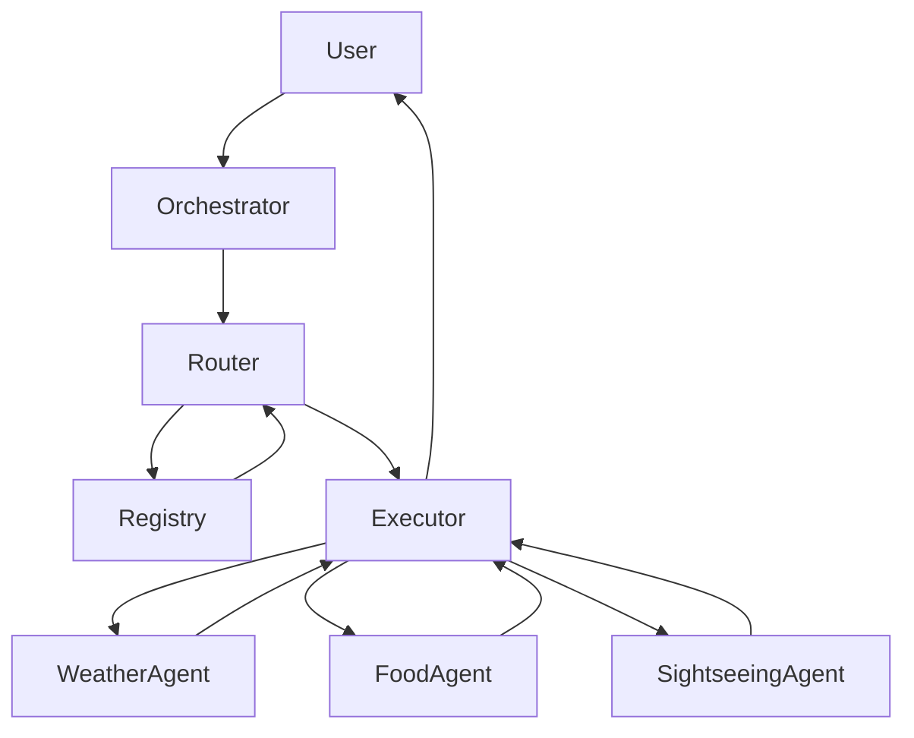

# Registry-Based Multi-Agent AI System

## Description

This project is a **Registry-Based Multi-Agent AI System** that demonstrates how independent AI agents can be dynamically discovered, intelligently routed, and safely orchestrated using modern agentic design patterns.

The system uses a **registry-based agent discovery service**, a **local LLM (Ollama)** for reasoning, and a **lightweight HTTP-based A2A (Agent-to-Agent) protocol** for communication. Agents run as isolated FastAPI services and are selected at runtime based on user intent.


## Features

- **Registry-Based Agent Discovery Service**
  - Agents self-register with a central registry at startup
  - Registry stores agent ID, capabilities, and endpoint
  - Router dynamically discovers agents at runtime (no hardcoding)

- **LLM-Based Intelligent Routing**
  - Local LLM (Ollama – Qwen 2.5) plans which agents are required
  - Routing is capability-driven and registry-validated
  - Prevents hallucinated agents or tools

- **A2A (Agent-to-Agent) Protocol**
  - Lightweight HTTP-based communication
  - Standard endpoint: `POST /agent`
  - JSON request/response contract
  - Agents run as independent network services

- **LangGraph Orchestration**
  - Router → Executor → End flow
  - Clear separation of planning and execution
  - Deterministic control with agentic reasoning

## Architecture & Agent Flow


## Tech Stack

- **Python** – Core programming language
- **FastAPI** – Used to build the agent registry, orchestrator, and individual agents as HTTP services
- **LangGraph** – Manages the orchestration flow between router and executor
- **Ollama (Local LLM)** – Provides on-device LLM reasoning for intelligent agent routing
- **Requests** – Enables HTTP-based agent-to-agent (A2A) communication
- **Pydantic** – Ensures structured request and response validation
- **External APIs**
  - Open-Meteo – Real-time weather data
  - OpenTripMap – Sightseeing and places data

## How to Run the Project

### 1. Install Dependencies
```bash
pip install -r requirements.txt
```
2. Start the Agent Registry
```
python registry_app.py

The registry runs on:
http://127.0.0.1:9000
```
3. Start the Agents (Run Each in a Separate Terminal)
```
python weather.py
python food.py
python sightseeing_app.py
```
Each agent:
Starts its own FastAPI server
Automatically registers with the registry

4. Start the Orchestrator
```
python app.py

The orchestrator runs on:
http://127.0.0.1:8000
